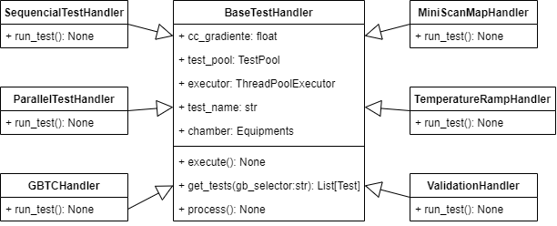
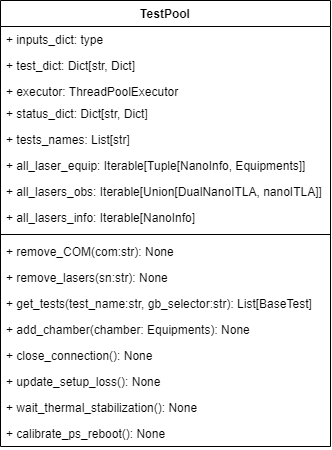

Sobre oq faler?

* Refatoração
  * dynamic_dict
  * Handlers
  * TestPool
* Paralelismo

## Desenvolvimento Teórito

### Teoria por trás do laser tunável de cavidade externa

...

### Prospector

Prospector é uma ferramenta de análise estática de código python, seungo a auto-descrição contida na página do projeto: "O Prospector é uma ferramenta para analisar o código Python e gerar informações sobre erros, possíveis problemas, violações de convenções e complexidade.

Ele reúne a funcionalidade de outras ferramentas de análise Python, como Pylint, pycodestyle e complexidade McCabe. Consulte a seção Ferramentas com suporte para obter uma lista completa de ferramentas extras padrão e opcionais.

O principal objetivo do Prospector é ser útil 'fora da caixa'. Uma reclamação comum de outras ferramentas de análise do Python é que leva muito tempo para filtrar quais erros são relevantes ou interessantes para seu próprio estilo de codificação. O Prospector fornece alguns perfis padrão, que esperamos fornecer um bom ponto de partida e será útil imediatamente, e adapta a saída dependendo das bibliotecas que seu projeto usa."

### Complexidade Ciclomática
...
colocar imagem ilustrativa
### Singleton
...
colocar uml
### Factory Method
...
colocar uml
## Atividiades Realizadas

### Paralelização de lasers duais

Um dos produtos desenvolvidos pelo grupo Idea são lasers duais, que possuem duas _goldboxs_ integradas numa mesma eletrônica reduzindo o tamanho resultante do conjunto. É utilizado um único micro-controlador e interface de comunicação para os dois lasers e apesar disso os lasers funcionam de forma independente. A distinção dos comandos de controle enviados para cada laser é feito por meio de um comando adicional que segue o protocolo estabelecido pela OIF, ou seja, após o envio do comando identificando qual o laser de destino da informação, todos os próximos comandos recebidos serão aplicados sobre o laser informado.

Dado o compartilhamento da interface de comunicação e o protocolo utilizado nos lasers duais, o fluxo de testes era aplicado de forma sequencial entre as _goldboxs_ e o tempo para execução do fluxo completo era quase que o dobro do utilizado em lasers que possuia uma única _goldbox_.

### Refatorações e Reestruturações

#### TestHandlers

Os scripts de calibração exigem um controle de temperatura do ambiente. Em alguns casos bastando que seja uma temperatura conhecida e constante, mas em outros é necessário variações controladas de temperaturas. Nesses casos o sincronismo entre as threads seria possível por meio de primitivas de sincronização como a barreira, mas isso tornaria o fluxo do teste demasiado complexo e prejudicaria a manutenibilidade do código. Para evitar o uso de primitivas de sincronização para esse fim, inicialmente foi utilizado trechos de código com a responsabilidade de manipular as câmaras termicas e coordenar a execução dos testes em threads. Cada um dos testes de calibração possui o próprio modo de manipular a câmara e devido a isso cada teste de calibração possuia o próprio trecho de código responsável por fazer essa atividade de modo que o trecho executado era escolhido de acordo com uma estrutura de controle de fluxo if-elif-else enorme disposto em um único arquivo. Essa estrutura de controle de fluxo possuia 101 de complexidade ciclomática e pouco mais de 300 linhas de código.

Para substituir essa estrutura de controle de fluxo, foram criadas classes que herdam alguns métodos e a interface de uma superclasse abstrata. Essas classes possuem a responsabilidade de manipular a câmara e a coordenação da execução dos testes além de inicializar o processamento, validação e exibição dos testes pertencentes ao seu domínio. Essas classes foram nomeadas de TestHandlers e são 7 classes no total.

#### TestPool

Os testes eram armazenados em dois dicionários diferentes, cada um possuindo uma forma diferente de indexação dos testes, de modo que qualquer busca de testes precisaria ser feita de forma manual, manipulando diretamente os dicionários e em caso de redmoção de um laser arbitrário do fluxo, essa remoção também era feita manipulando diretamente os dois dicionários, pois há a necessidade que a informação dos dicionários seja sincronizada.

Para que a manipulação dos dicionários não seja feita de forma direta, uma classe singleton chamada TestPool com a responsabilidade de armazenar os testes foi criada. Além de armazenar os testes, essa classe implementa uma série de facilidades de buscas de testes, iteradores sobre os testes, os lasers, e ou os equipamentos dos testes e métodos de remoção de lasers também foram implementados. Apenas o trecho responsável por remover os lasers do fluxo de testes se repetia 7 vezes e era responsável por 63 dos 101 de complexidade ciclomática da estrutura de controle de fluxo mensionado anteriormente.

Com a finalidade de mensurar o impacto na melhoria do código, uma ferramenta de análise estática de código foi utilizada, a ferramenta em questão foi a Prospector. Antes das modificações citadas, o Prospector apresentava 71 mensagens que são erros, possíveis problemas, violações de convenções e complexidade. Após as modificações citadas o Prospector passou a exibir uma única mensagem referente a uma violação de convenção.

#### Detecção dos equipamentos

No inicio da execução dos testes, existe uma etapa automatizada de detecção dos equipamentos conectados a cada um dos lasers. Os equipamentos mudam de acordo com a disponibilidade e os testes que serão executados e com o passar do tempo foram surgindo novos testes e diferentes equipamentos, fazendo com que a função responsável por isso acabasse ficando complexa, com 44 de complexidade ciclomática, devido a isso foi necessário realizar uma refatoração.

Grande parte da complexidade ciclomática atrelada a essa função era devido ela diretamente determinar quais classes de equipamentos deveriam ser instanciadas e quais argumentos deveriam ser passados na instanciação. Utilizando o padrão de projeto denominado _factory method_ foi possível delegar essa tarefa de instanciação de objetos para uma função especializada.

A função de detecção dos equipamentos também fazia distinção entre as _goldboxs_ RX e TX, fazendo com que houvesse duplicação de boa parte do código, essa diferenciação entre as _goldboxs_ foi amenizada, fazendo com que fosse possível remover quase totalmente o código repetido.

Antes da refatoração o código possuia 44 de complexidade ciclomática, 245 linhas de código e 58 mensagens de erros ou possíveis problemas ou violações de convenções encontrados pelo Prospector. Após a refatoração a complexidade ciclomática caiu para 13, o número de linhas foi de 184 e o Prospector apresentou apenas 5 mensagens.